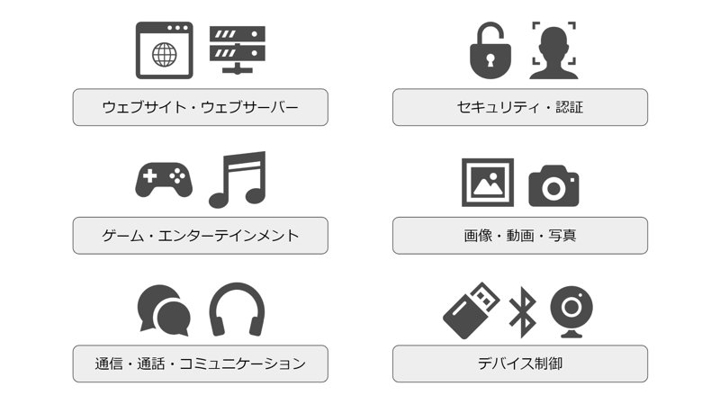
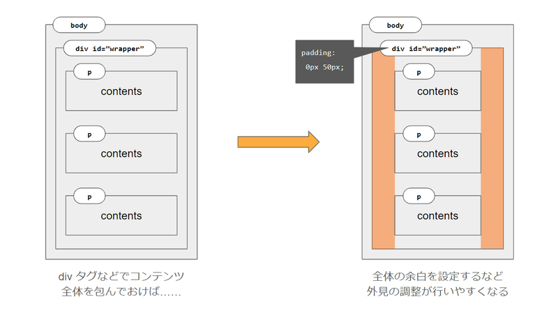
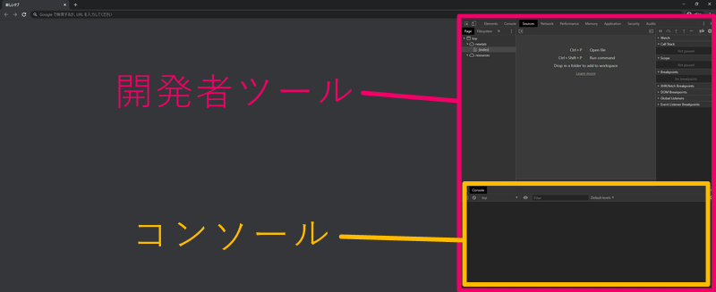
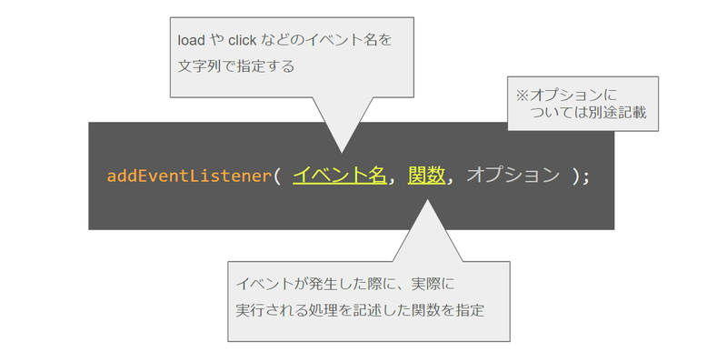

# JavaScript の基礎から学ぶ

* JavaScript基礎

<section class="contenttextsection">

## 概要と導入

JavaScript の使い方の基本を覚えながら、いずれは Canvas2D や WebGL などの API を利用したグラフィックスプログラミングにも取り組んでみたい、そんな **入門者向け** の **JavaScript 基礎編** の第一回です。

HTML と CSS の基礎を既に習得済みであれば、JavaScript を使い始めること自体はそれほど難しくはありません。

しかしプログラミング自体が初めてである、という場合は最初は戸惑うことも多いかもしれません。できる限りわかりやすく解説しますので、少しずつ、自分のペースで進めていきましょう。

## JavaScript とはなにか

JavaScript は、インターネットを閲覧するためのソフトウェア（アプリケーション）である「ウェブブラウザ」を中心に、様々な環境上で動作するスクリプト言語です。

JavaScript を自由に記述することができるようになると、ウェブサイト上で動作する「プログラム」を実装することができるようになります。また、近年では JavaScript を利用して一般的なデスクトップアプリケーションを作成することもできるようになってきていて、JavaScript というたったひとつの言語を覚えるだけで、様々なジャンルのプログラミングに挑戦することができます。

インターネット越しにアクセスできるいわゆる「ウェブサイト」はもちろん、それを配信するための「ウェブサーバー」を構築するのに JavaScript を利用してみたり、あるいはゲームやユーティリティツールのような便利で楽しいアプリケーションを開発することもできます。

さらに言うと、JavaScript で制御・干渉できる領域はいまも現在進行系でどんどん広がっています。近年 JavaScript は非常に人気のあるプログラミング言語になりましたが、そういった背景も人気がある要因のひとつだと言えるでしょう。

#### 様々なことを実現できる JavaScript



なぜ JavaScript ひとつでそんなにもたくさんのことが実現できるのか……

少なくとも今の段階では、そのことについてひとつひとつ詳細に理解している必要はないでしょう。過度に心配しなくても、少しずつ学習を進めていけばおのずとそれらのことに対する理解は深まっていくはずだからです。

ここでまず認識しておきたいことは、JavaScript は始めるのに敷居が低く導入が簡単であり、またその割には、応用できる範囲がとても広く人気のあるプログラミング言語である、ということかなと思います。

ただし、導入が簡単だからといって、それが必ずしも **プログラミング自体が簡単であることとイコールではない** 点には注意しましょう。最初は特に、ちょっと難しく感じてしまうことが多かったり、説明の意味がわからないこともあるかもしれません。しかしどのようなことを学習するときでもそうだと思いますが、困難な問題を解決したり、自分の知識をより深いものにしていくためには、努力や忍耐が必要になる場面も必ず出てきます。

だからこそ、大事にしてほしいのは **楽しめる範囲でがんばってみる** ということです。

楽しくなくなってしまうと、本当に……なんというかつらいだけになってしまいます。まずは自分自身の「楽しい！」や「おもしろい！」という気持ちを大事にしましょう。そんなの当たり前のことだろ、と思うかもしれませんが、これが意外と大切なのです。

> ### スクリプト言語ってプログラミング言語とは違うの？
> 
> まず前提として「スクリプト言語」という言葉に対する明確な基準はありません。
> 
> ○○な要件を満たしているからスクリプト言語だ！ みたいな基準があるわけではない、ということですね。それでは、一般にスクリプト言語と言った場合、これは何を指していると考えればよいのでしょうか。
> 
> 前後の文脈などによって多少の揺れはあると思いますが、スクリプト言語とは「導入や、その実行が、比較的簡易で手間なく行えるもの」を指している場合が多いと言えます。ここで言う「導入や実行」とは、たとえばプログラミング言語を記述するための開発環境の準備や、それを実行して結果を確認するための手順と考えればいいでしょう。
> 
> 実際のところ、スクリプト言語と呼ばれることの多い言語は、比較的簡単に開発環境を整えることができたり、すぐに手間なく（記述したコードの）実行結果を確認できたりするものが多いです。
> 
> ちょっと注意しなければならないのは「スクリプト言語 ＝ 簡単な言語」という意味ではないという点です。環境構築などが比較的容易であるということと、その言語を扱うことが簡単か難しいかということは別の問題ですので、そこを混同しないように注意しましょう。

## サンプルの基本的な構成

前置きが長くなりましたが、さっそく今回のサンプルの内容を見ていきます。

JavaScript 基礎編の第一回ということなので、サンプル自体は実にシンプルな構成になっています。

```
0001
 ├ index.html // ブラウザに表示される HTML
 ├ script.js  // index.html から読み込まれるスクリプト
 └ style.css  // index.html から読み込まれる CSS
```

利用しているファイルは３種類あります。

ウェブページとしてウェブブラウザ上に正しく表示されるようにするために `index.html` というファイルを用意し、そこから JavaScript や CSS のファイルを読み込みます。

該当する HTML ファイルの中身は、以下のようになっています。
</section>

<section class="contentcodesection"><div class="codesectionleft">

```
<!DOCTYPE html>
<html>
    <head>
        <script src="./script.js"></script>
        <link rel="stylesheet" href="./style.css">
    </head>
    <body>
        <div id="wrapper">
            <p>
                これは段落です。
                段落はブロック要素となるため、それ単体で改行を伴うひとつのブロックになります。
                HTML では、ファイル上で改行されている部分であっても、そのまま改行が反映されるわけではありません。
                事実、この &lt;p&gt; タグで記述された段落は、実際にブラウザでプレビューしてみるとすべての文章が横一列につながった状態で表示されます。
                （ただしウィンドウ幅の限界まで到達すると自然に改行されたように文章が回り込みます）
            </p>
            <p>
                一方で、ブロック要素とは異なり、改行を伴わず、ひとつの文章のなかに埋め込むことができるものを <span class="red">インライン要素</span> と呼びます。
            </p>
            <p id="out">
                <!-- ここに JavaScript から文字を出力 -->
            </p>
        </div>
    </body>
</html>
```

</div><div class="codesectionright">

ここでは HTML については詳しく解説しませんが、HTML5 方式で `DOCTYPE` を指定しつつ `<head>` タグと `<body>` タグから構成されたオーソドックスな形じゃないかなと思います。

`<head>` タグの中身を見ると、同階層にある `script.js` や `style.css` を読み込んでいることがわかるかと思います。

ちなみに、ファイル名の手前に `./script.js` のように「ドット＋スラッシュ」が書かれている場合、これはそのファイルが **index.html と同じ階層に置かれている** ことを意味しています。（同じフォルダに入ってるファイルだよ、ということですね）

</div></section>

<section class="contenttextsection">

> ### 相対パスと絶対パス
> 
> HTML の中に記述するファイルへの参照や、プログラミングで登場するファイルの位置の指定には、ここで登場したような `./script.js` のようなドットとスラッシュを組み合わせた表記が出てくることがあります。
> 
> まず前提として、プログラミングやパソコン等のコンピューターを扱う分野では、ファイルの位置を指定するこれらのアドレスのことを「パス」と呼びます。そして今回登場したような、ドットとスラッシュを組み合わせたパスの記述は「相対パス」と呼ばれます。なんらかの「起点となるファイル」から見た「相対的な位置を指定するパス」であることから、相対パスと呼ぶわけですね。
> 
> 一方で、相対的な位置ではなく、常に一定の位置を確実に指し示す方法として「絶対パス」という言葉もあります。
> 
> 絶対パスでは、起点となる位置というのがそもそも想定されておらず、常に一定の位置を間違いなく指し示すために最初から最後まで省略せずにパスを指定します。たとえば `https://webgl.dev/index.html` は絶対パスです。 `https` から始まるすべてのパスが指定されていて、それに完全一致する位置を指し示します。
> 
> HTML にパスを指定する場合、もちろん `https://webgl.dev/sample/0001/script.js` のように絶対パスで記述しても問題ありませんが、ファイルを格納しているフォルダの名前が変わったりすると、その都度パスを修正しなくてはならなくなります。一方で、相対パスで記述されていれば常に相対的な位置でファイルを指定しているため、絶対パスに比較するとパスの修正を必要とするケースは少ないと言えるでしょう。

さて、サンプルの HTML をあらためて見てみると、 `<body>` の直下にまず `<div id="wrapper">` というように `id` 属性を持った `<div>` タグがあり、これが全体を覆っている形になっています。

特に深い意味があるわけじゃないのですが、HTML として書かれたコンテンツ全体に対する操作を行いたいケースが後から出てくることも踏まえつつ、私の場合はこんなふうに全体を包んでおくような書き方をすることが多いです。ウェブサイトは絶対にこういう構造にしないとダメだ、というものではありません。

#### 全体を包むような構造にする理由



HTML に不慣れな人のために一応もう少しだけ補足すると `<p>` タグの中身に書かれている `&lt;` と `&gt;` は一見すると文字化けのようにも見えるんじゃないかなと思いますが、これは **HTML エンティティ** と呼ばれるもので、記号などの HTML として解釈されてしまう文字を正しく文章として表示するための特殊な表現です。

> ### HTML によるマークアップと、CSS によるスタイリング
> 
> ウェブサイトの構築では、余白を設定して隙間を広げたり、文字や要素を右揃え・左揃えにしたり、あるいは特定の箇所だけ色を変更したりと、見た目について細かく調整するような作業が大量に発生します。一般に、これらの「外見に関する設定」は HTML 自体ではなく CSS によるスタイリングで調整を行います。
> 
> 間違っても、隙間を大きく空けたいからといって大量の全角スペースや半角スペースを書いたりしてはいけません。余白を大きく取りたいなら、そのような CSS を適用して調整する、というのが正しいアプローチです。
> 
> そもそも、HTML を読み込んで表示するいわゆる「ウェブブラウザ」の多くは、半角スペースやタブ文字・改行文字などの一部の文字が連続している場合、それを **自動的に半角スペース１つ分に変換** して表示してしまいます。たくさんスペースやタブ文字を並べても、それがそのまま文字として画面に表示されるわけでないのですね。
> 
> 実際、先程掲載した HTML ファイルも、見やすさのためにインデントを行っている箇所がいくつもありますので、HTML の中にたくさんの半角スペースを記述していますよね。にもかかわらず、これを実際にプレビューするとそのような大量のスペースやタブ文字はブラウザの画面上には現れません。
> 
> なんらかの理由で、どうしても半角スペースを複数並べて記述しなければならない場合は、HTML エンティティを使ってやると半角スペースなどが連続する場合であっても、確実にスペースひとつ分の文字として HTML 上で表現することができます。（半角スペースのエンティティは `&nbsp;` が用いられることが多いですが、実はこれも単なるスペースではないので……興味のある方は調べてみると面白いかもしれません）
> 
> 繰り返しになりますが、半角スペースを HTML エンティティで表現できるからといって、これをスタイリングの目的で利用するのは間違いです。HTML と CSS の役割の違いを意識しつつ、適切に使い分けを行うようにしましょう。

## JavaScript の関数

さて、それではいよいよ JavaScript 側のコードも見てみます。

JavaScript はファイルの拡張子が `*.js` のように js となっているファイルで、HTML 側から `<script>` タグの `src` 属性の指定によって読み込まれると即座に実行されます。

ちなみに、今回のサンプルの場合は `script.js` という JavaScript ファイルを読み込んでいますが拡張子以外の部分（ファイル名）は自由に名前を変更しても大丈夫です。（ただしその場合は HTML 側のファイル名の指定も変更しておきましょう）

実際にサンプルの JavaScript ファイルの中身は、以下のようになっています。行数自体は、それほど量は多くないですね。

JavaScript は基本的に「記述されたコードの上から下に向かって順番に」実行されていきます。そのことを踏まえつつ内容を確認してみると、ここではまず最初に JavaScript の **関数の定義** が行われています。
</section>

<section class="contentcodesection"><div class="codesectionleft">

```
// JavaScript での関数の定義
function loaded(){
    // const キーワードでの変数宣言と、セレクタによる要素の参照
    const out = document.querySelector('#out');
    // 参照先の要素にテキストを設定
    out.textContent = '👻👻👻';
}

// ウェブページのコンテンツがロード完了した時点で自動的に関数を実行
window.addEventListener('DOMContentLoaded', loaded, false);
```

</div><div class="codesectionright">

JavaScript では `function` というキーワードを使って関数を定義することができます。

この `function` キーワードに続けて、任意の **関数名** を指定します。

関数名は、アルファベットの大文字と小文字が区別されます。また、関数名に含めることができる記号は `$` （ドル記号）または `_` （アンダースコア、アンダーバー）のみです。

関数名には数字も使うことができますが、数字を「関数名の先頭に持ってくることはできない」ので注意しましょう。

</div></section>

<section class="contenttextsection">

`function` キーワードと関数名に続く `()` の部分は **引数** と呼ばれる「関数を呼び出す際に渡すデータ」を受け取るための窓口となる括弧です。引数が必要な場合は丸括弧のなかに指定するわけですが、引数は省略することもできるので、ここでの例のように `function 任意の関数名()` というように中身が空の状態で書いても問題ありません。実際に引数を指定する場合はどうすればいいのかについては、今後、引数を利用する場面であらためて詳しく解説したいと思います。

`function 任意の関数名()` の最後の丸括弧に続く `{` の記号は、ここから関数が始まることを意味する波括弧です。これに対応する `}` という閉じ括弧が出てくるところまでが関数の実体になります。この「関数の実体」が、関数が呼び出された際に実際に実行される処理の部分になります。

なお、ここでの例のように「処理のひとかたまりを `{` と `}` で包み込んだ領域」のことを **ブロック** と呼びます。

#### 関数の定義を行う構文



## 関数の実行（呼び出し）

関数は、定義された時点では **まだ実行されません** ので、その点には注意しましょう。

つまり関数とは、まず先に定義だけを行っておいてから、任意のタイミングでその関数を呼び出すことで初めて実行されます。ちょっと違った言い方をすると関数とは「何かしらの処理に名前をつけてひとくくりにしたもの」であり、その何かしらの処理を実行したいときは、関数名を指定するなどして呼び出してやる必要がある、ということになります。

関数を使わずに、「まず最初に○○をやって、次に△△をやって……」のように順番に処理を記述しておいても、JavaScript は正しく実行されます。しかしたとえば「ここはファイルを開いている処理を行っている場所だから、open という名前の関数にしよう」というように、処理の内容に応じたわかりやすい名前をつけて関数化しておくことで、コードに対して適切に意味づけが行われ、より管理しやすい状態を維持することができます。

逆に、雑然とたくさんの処理が並んでいる状態では、コード（やその文脈）を読み解くのが難しくなります。

できる限り小さな単位で処理をひとかたまりに分類し、わかりやすい名前をつけて関数化する……これを心がけるだけで、コードはとても見通しの良いものになりますので、覚えておくといいでしょう。

#### JavaScript における関数定義のおさらい

```
function XXXXX(){
    // XXXXX には任意の関数名を指定する
    // 関数ブロックのなかの処理が関数呼び出しによって実行される
}
```

さて、この「関数」ですが、先程も書いたとおり関数は定義された段階ではまだ実行されません。

あくまでも、定義した関数に対する「呼び出し」があった際に初めて関数の中に記述された処理が実行されます。

関数の呼び出しには、関数名に続けて `()` を記述します。 **関数名()** という感じです。

このとき、その関数に対してなんらかの値を渡すことができ、これを関数の **引数** と呼びます。引数は、複数同時に定義したり、あるいは呼び出し側から渡したりすることができますが、そういった場合はカンマ（ `,` ）で区切ります。

ちなみに、関数の「定義側で引数が定義されていない」状態でも、関数を呼び出している側から引数を渡しても無視されます。エラーが発生したりすることもありません。

#### 関数の呼び出しと引数の指定の例

```
// 引数を持たない関数の定義
function XXXXX(){
    alert('XXXXX が呼び出されました');
}

// 引数を定義している関数の定義
function YYYYY(arg){
    alert('YYYYY が呼び出されました');
    alert('引数は' + arg + 'でした');
}

// それぞれの関数の呼び出し
XXXXX();     // → XXXXX が呼び出されました
XXXXX(9999); // → XXXXX が呼び出されました　※エラーにはならない
YYYYY(9999); // → YYYYY が呼び出されました　引数は9999でした
``` 

> ### JavaScript のコメント
> 
> JavaScript ではコードの中にコメントを記述することができます。
> 
> コメントには「その行のなかで、対象の箇所以降をコメント化する」ことができるインラインコメントと、「改行を含む複数の行をまとめてコメント化する」ことができるブロックコメントがあります。
> 
> ```
> // スラッシュ２つでインラインコメント
> 
> function XXXXX(){
>   const foo = 'baa'; // 行の途中から始まるインラインコメント
> }
> 
> /* スラッシュとアスタリスクで、ブロックコメント
> function YYYYY(){
>   const foo = 'baa';
> }
> */
> ```
> 
> スラッシュを２つ重ねたインラインコメントでは、スラッシュ以降の「同じ行に書かれた内容」がコメントとして扱われます。
> 
> 一方で、スラッシュとアスタリスクを組み合わせて記述するブロックコメントの場合、複数行をまとめてコメント化することも可能です。この場合は `/*` がコメントの開始を意味する記号となり `*/` がブロックコメントの終了を意味する記号となる感じですね。
> 
> 一般的にプログラミング言語で「コメント」という場合は、プログラムとして実行されない、文字通り単なるコメント（メモ書きや説明）という扱いになります。
> 
> プログラムを書いた直後であれば「そのコードが何を意味しているのか、何を行っているのか」は、いましがた書いたばかりの処理ですし少なくともその瞬間の本人にとっては明らかな場合が多いでしょう。しかし数日後、数週間後、あるいは数カ月後にそれを見たときには、意味がわからなくなってしまっているなんてこともよく起こります。そういう意味では、コメントを丁寧に残しておく意味はそれなりにあると言えます。（ただし人により程度は様々です）
> 
> またコメントを書いておく意味・意図としてはその他にも、他人が見てもわかりやすいコードにするためであったり、情報を整理するために特定のルールに則ってコメントを記載しておき、それをドキュメントのように活用するためであったりと、様々な理由があります。注意しておきたいポイントとしては、コメントがあまりにも多すぎると、逆にコードが読みにくくなってしまったりすることもありますので……ただコメントをたくさん書けばよいと思い込むのではなく、必要に応じて、適切にコメントを残しておけるように努力してみることが大切かなと思います。

## 関数を関数の引数に渡す

さて、関数はまず最初に定義を行い、あらためて呼び出しを行った際に初めて実行されることがわかりました。また、関数を呼び出す際には `関数名()` のように記述すればよく、時と場合により引数を指定することができるのでした。

しかし、今回のサンプルのコードをよーく観察してみると……

せっかく定義した `loaded` 関数を **丸括弧を付けて呼び出している箇所** がどこにも見当たりません。しかし一方で、実際にサンプルが実行されている様子を確認してみると `loaded` 関数が実行された際に実行されるコードによって「👻👻👻」の絵文字がページ上に出力されます。（この記事の冒頭部分に置かれたデモ実装を見ても、絵文字出力が正しく動作している様子が確認できると思います）

呼び出しされている様子がないのに、どうしてこのような結果になるのでしょうか。

その答えは `loaded` 関数の定義が終わったあと、続けて記述されている部分にヒントがあります。該当する箇所を引用すると以下のようになっています。

#### 関数定義の次に書かれていたコードの抜粋

```
// ウェブページのコンテンツがロード完了した時点で自動的に関数を実行
window.addEventListener('DOMContentLoaded', loaded, false);
```

実はこの部分、JavaScript によるプログラミングの特徴をよく表しています。

このコードの内容をよく見ると `window.addEventListener` を呼び出すための `()` の中に、３つの引数が指定されていることがわかります。これらの引数のうち、第２引数を見ると `loaded` と書かれていますよね。この `loaded` は、つい先程定義したばかりの `loaded` 関数にほかなりません。

このことからわかるのは、JavaScript では **関数も値として扱うことができる** ということです。

ちょっとわかりにくいと思いますので `addEventListener` についても説明しつつ補足します。

`addEventListener` は、３つの引数を取ります。引数の意味はそれぞれ以下のようになります。

#### addEventListener の引数の型と意味

| 引数 | 型 | 例 |
|---|---|---|
| 第１引数 | 文字列 | `'load'` , `'click'` , `'keydown'` などのイベント名 |
| 第２引数 | **関数** | イベントが発生した際に実行する関数 |
| 第３引数 | 真偽値, またはオブジェクト | `true` , `false` やオブジェクト |

これを見るとわかるように、JavaScript では「引数に関数を期待するケース」が登場します。しかも、こういった「引数に関数を期待するケース」は結構頻繁に出てきます。

なんらかの関数が「引数として関数を受け取る」場合というのがどういう場面なのかを考えてみると、たとえば「関数 A の中で関数 B を使いたい場合」であるとか、「関数 A が終了したと同時に関数 B を実行したい場合」などが考えられます。 `addEventListener` は「ページがロードできた」とか「クリックされた」などの、契機となる出来事が起こったときに自動的に処理を実行できる機能を持っています。ちょっと違った言い方をすると「なにかが起こったときの処理をあらかじめ登録しておくことができる」ということでもあります。

ですから、ユーザーがクリックした時に処理を実行したいとか、ユーザーがキーボードの入力を行った際に処理を実行したいといった場合には、この `addEventListener` を利用すればいいわけです。

#### 関数の定義を行う構文



上記を見るとわかるように `addEventListener` は第２引数に関数を受け取ります。

この第２引数に指定された関数が、クリックなどのイベントに反応して実行されるわけですね。

ではそれらのことを踏まえて再度、 `loaded` の定義の次に書かれていたコードを見てみます。

#### 関数定義の次に書かれていたコードの抜粋

```
// ウェブページのコンテンツがロード完了した時点で自動的に関数を実行
window.addEventListener('DOMContentLoaded', loaded, false);
```

`addEventListener` の第１引数に指定するのは「対象となるイベントの名前」を文字列によって表したものです。

`addEventListener` に登録できる「契機」は「イベント」とも呼ばれます。というか普通はイベントと呼ぶことのほうが多いでしょう。今回のサンプルで登場した `DOMContentLoaded` はウェブブラウザによって HTML のパースが完了した瞬間に発生するイベントです。

この `DOMContentLoaded` イベントを契機にして処理を行うようにしている理由は、ウェブブラウザが HTML を解釈し終わっていないときに、HTML の中身を参照するような処理を行ってしまうと、当たり前といえば当たり前なのですが「HTML が解釈し終わっていないので正しく参照を取得することができなくなってしまう」ためです。

つまりここまでの内容をまとめると、次のようになるでしょう。

* まず冒頭で `loaded` という関数を定義する
* 関数は定義しただけではまだ実行されない
* 関数をイベントに応じて実行するには `addEventListener` を利用する
* ウェブブラウザが HTML を解釈し終わったタイミングは `DOMContentLoaded` イベントを監視することでわかる
* `DOMContentLoaded` イベントが発生したら `loaded` 関数を実行するようにしたい
* `addEventListener` の第１引数にイベント名を――
* 第２引数に関数そのものを渡して登録している

> ### load イベントと DOMContentLoaded イベント
> 
> `window` に対して設定できるイベントには `DOMContentLoaded` 以外にも様々な種類のものがあります。
> 
> 数々あるイベントのなかでも `DOMContentLoaded` と似たイベントに `load` イベントがあります。両者は語感も似ていますし、場合によってはほとんど同じように動作するため、ちょっと違いがわかりにくくなっています。
> 
> `DOMContentLoaded` イベントは、ウェブブラウザが HTML をパースし解釈した時点で発生（発火）します。一方で `load` イベントのほうは、HTML に記述されているすべての要素の読み込みが完全に完了したときに発生するイベントです。わかりやすい例としては、サイズの大きな画像を含むウェブページなどでは、両者に顕著な違いが現れます。
> 
> HTML のなかで `` タグなどを使って画像を読み込んでいる場合、通信速度にもよりますが、普通は画像は少しずつ読み込まれていきます。この画像の読み込みが完全に完了するまでは `load` イベントは発生しません。しかしこのようなケースであっても `DOMContentLoaded` は HTML がウェブブラウザによって解釈された段階で発生するので、画像の読み込みが途中であっても先行して発生します。
> 
> 一般に、ウェブサイトで画像や動画を読み込みしている待ち時間の間にも、ユーザーはウェブサイトを閲覧しています。ですから、ウェブページがロードされると同時になにか JavaScript の処理を行いたい場合には `load` イベントよりも `DOMContentLoaded` イベントを用いるのが適切な場合が多いと言えます。両者の違いを正しく理解して、適切に使い分けができるようにしていきましょう。

</section>

