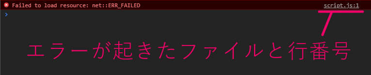
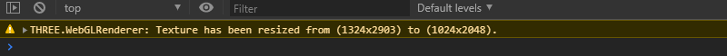
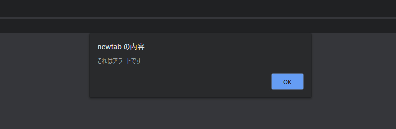
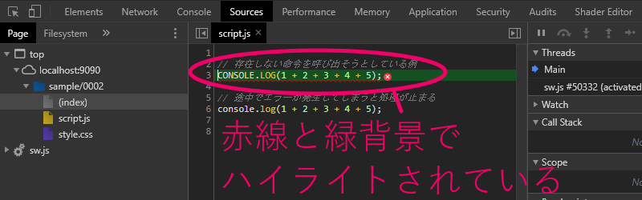
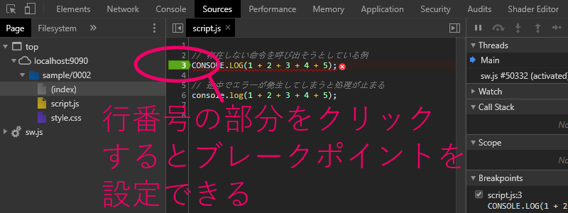
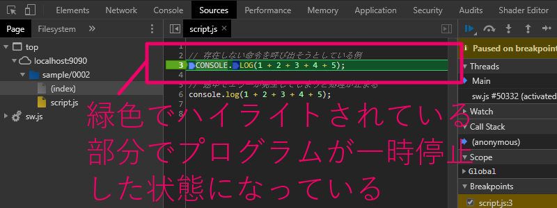
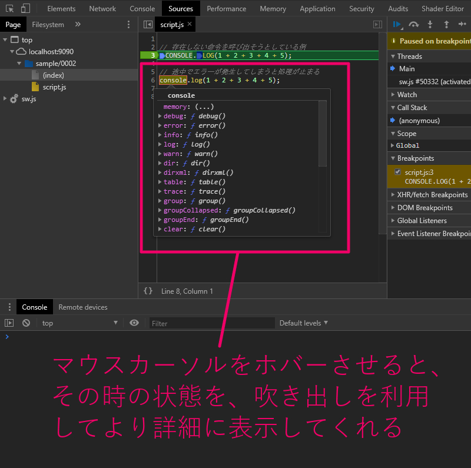

# JavaScript 基礎（エラー・デバッグ・開発者ツール）

* JavaScript基礎

<section class="contenttextsection">

## 概要

今回は JavaScript でプログラミングを行っている際に、必ず直面することになる **エラー** や、それを解消するための **デバッグ** 作業にフォーカスを当ててみます。また、デバッグ作業を行う際にとても役立つ **開発者ツール** についても、ここで簡単にその使い方について説明します。

JavaScript で開発を行う場合に限らず、プログラミングにおいては「エラーに直面したときにどう考え、行動に移すか」がとても大切です。なぜなら、エラーや不具合、あるいは意図していない動作は **必ず起こる** からです。

どんなに熟練したプログラマーであっても、エラーや不具合に直面することはあるはずです。そして、プログラマーとしての熟練度が高い人ほど「エラーや不具合、バグや意図しない動作は常に起こり得る」ということを理解していますし、それを前提にした上でどうするべきなのかを考えているものだと思います。

ウェブブラウザ上で動作する JavaScript を扱う上では、開発者ツールという非常に強力な機能を利用することができます。今回の内容を通じて、エラーやデバッグ作業、開発者ツールの使い方について、簡単にで構いませんので基礎を身に着けておきましょう。

## JavaScript のエラー表示

プログラミング言語によって多少の違いはありますが、エラー（Error）と言った場合、これは「プログラムは正しく動作することができなかった」ということを表します。

エラーが発生する場面の例としては、たとえば「構文上、間違った記述がなされている」場合や、「存在しない命令を呼び出そうとした」場合などが挙げられます。JavaScript の場合は、エラーが発生してしまうと JavaScript の動作自体がそこで停止してしまい、その後の処理が行われなくなってしまいますので注意が必要です。

しかし、通常ウェブサイトをユーザーとして閲覧している場合は、この「JavaScript のエラー」を直接目にすることはほとんどありません。ただしその場合でも、後述する開発者ツールには「人知れずエラーの内容が出力される」ようになっています。

試しに、PC でこのページを閲覧しているのであれば、キーボードから、Windows 環境なら `Ctrl + Shift + i` を、Mac 環境であれば `Command + Option + i` を入力してみましょう。[JavaScript 基礎の第一回の記事](https://webgl.dev/?v=1)でも説明したとおり、このようなショートカットキーの入力を行うと開発者ツールを開くことができ、閲覧中のページでなにかしらのエラーが発生している場合には、この開発者ツールに内蔵されているコンソール上にエラーの内容が出力されているのを確認することができます。（もちろん、何もエラーが起こっていない場合もあります）

#### 開発者ツールのコンソールにエラーが表示されている例


ここでの例のように、開発者ツールのコンソールには、エラーが発生すると **赤い文字** でエラーの内容が示されます。JavaScript が原因で発生するエラー以外にも、HTML で指定されているファイルが見つからない場合などに、同様に赤い文字でエラーの内容がコンソール上に表示されます。

原因が JavaScript のソースコードにある場合は、原因となった箇所を「ファイル名と行番号」で示すリンクが表示されます。

このようなエラー箇所を示すリンクなどを活用しつつ、JavaScript のコードのうち、どの部分で、どのようなエラーが発生しているのかを把握し、なんとかして問題を解決することを目指すわけですね。

#### 開発者ツールのコンソールでエラーの箇所を確認できる



## ウェブブラウザなどのワーニング表示

また、開発者ツールのコンソールには、エラーだけでなく **ワーニング** が出力されることもあります。

ワーニング（Warning）とは、JavaScript の動作が止まってしまうような致命的な状況では無いけれども、推奨されない記述がなされていたり、あるいは開発者に注意を促したりしたい場合などに出力されることが多いです。

それらのほとんどはウェブブラウザ（たとえば Google Chrome）が自動的に出力しますが、なかには「JavaScript のコードを記述した開発者が意図的に出力している」場合もあります。

開発者がワーニングを出力するような記述をあえて行う場面の例を挙げると……　たとえば、「このライブラリでは、その○○という命令は今は一応動くけどもう古いよ、非推奨だよ！」みたいなことをライブラリの利用者に伝えたい場合などが考えられます。プログラムは大抵の場合日々改善されていきますので、昔は普通に使えた命令や記述方法であっても、それが時の経過と共に古いものになっていくこともあるわけですね。

#### 出力されたワーニングの例



このキャプチャ画像は、開発者ツールに出力された three.js というライブラリのワーニング表示です。ご覧の通り、エラー表示とは異なり、ワーニング表示では **黄色い文字** によってコンソールへの出力が行われます。

three.js では、画像の大きさ（高さと幅）が非推奨のサイズになっている場合、ライブラリ側で自動的にこれをリサイズします。非推奨のリソースを使ってますよ～ ということをワーニングとして表示することで、three.js を使っている開発者に対して注意を促しているわけですね。

> ### エラーとワーニング、そしてバグ
> 
> エラー（Error）もワーニング（Warning）も、日本人の一般的な感覚で言えばどちらもなんとなく「よくないこと」という印象がありますよね。
> 
> すべてのプログラミング言語ということではありませんが、一般的に多い解釈として「Error は致命的な内容」であることが多く、一方で「Warning はあくまでも警告」というニュアンスとなっていることが多いです。JavaScript の場合も、ここまで説明してきたことを踏まえれば、エラーとワーニングはまったく異なる意味であることがわかるでしょう。
> 
> それでは、「バグ」と言った場合には、これは何を表しているのでしょうか。
> 
> 漫画や映画などでもプログラミングの文脈でよく登場するキーワードであるバグ（Bug）ですが、こちらもやはり、エラーやワーニングとはまったく意味が異なります。
> 
> バグとは、必ずしもエラーやワーニングを指しているのではなく、プログラムは問題なく動作していても「それが意図した振る舞いと違う場合」に用いられます。たとえば、足し算をしてくれるプログラムを書いていたはずなのに、どうも答えが引き算になってないか？ みたいなケースは、プログラムとしてはエラーもワーニングも起こりませんが、意図した挙動とは異なる動作をしています。ここではわかりやすさのためにかなりシンプルな例で説明しましたが、バグはかなり意味が広い言葉なので、誤った使い方をしないように気をつけてみるといいでしょう。

## エラーが発生すると JavaScript の実行が止まる

先程も少し書いたとおり、JavaScript ではエラーが発生してしまうとその瞬間に JavaScript の実行が止まってしまいます。

このことをもう少し具体的な例として観察することができるのが、今回の記事に付属するサンプルです。

実際のサンプルのソースコードを見ながら考えてみましょう。

</section>

<section class="contentcodesection"><div class="codesectionleft">

```
// 存在しない命令を呼び出そうとしている例
CONSOLE.LOG(1 + 2 + 3 + 4 + 5);

// 途中でエラーが発生してしまうと処理が止まる
console.log(1 + 2 + 3 + 4 + 5);

```

</div><div class="codesectionright">

このコードを見ると、まず最初に `CONSOLE.LOG` という処理が書かれています。JavaScript では、アルファベットの大文字と小文字は区別されるので…… `CONSOLE` と `console` はまったくの別物として扱われます。

ですから当然のことながら `CONSOLE.LOG` を実行しようとした場合に、 `console.log` が代わりに実行されるというような、そんな都合のよいことが勝手に起こったりはしません。

</div></section>

<section class="contenttextsection">

これまでにもサンプル内で、開発者ツールのコンソールへと出力する目的で `console.log` をたびたび使ってきましたが `CONSOLE` というオブジェクトは JavaScript のネイティブ（もともと JavaScript に実装されている機能）には存在しないので、これは **エラー** になります。

未定義の、未知の機能を使おうとしてしまっているのでエラーが発生するわけですね。

ちなみに、このようなケースでは以下のようなエラーが起こります。これは実際に開発者ツールを使ってみなさんのお手元でも簡単に再現することができるので、気になる方は開発者ツールのコンソール上で、実際に実行してみるとよいでしょう。

#### 定義されていない命令を実行した際のエラーの例



## エラー箇所の特定とステップ実行

ここまで見てきたように、JavaScript では常に「エラーやワーニングが発生する可能性」があります。それでは、実際にエラーが起こってしまった場合には、どのように対処すればよいのでしょうか。

エラーが発生したり意図しない動作（バグ）が見つかった場合には、当然ながら、これを改善するための処置を行うことになります。一般に、このような処置はデバッグ作業、あるいは単に **デバッグ** と呼ばれます。バグに対処することを指して debug と呼ぶわけですね。

JavaScript のデバッグ作業は、開発者ツールを使うことで効率よく行うことができます。というよりも、開発者ツールを使わずにデバッグを行うのはかなり大変なので、ぜひここで簡単にで構いませんので開発者ツールによるデバッグ作業について学んでおきましょう。

まず、先述のとおり、JavaScript の実行に際してエラーが発生した場合には、開発者ツールのコンソール上に「赤い文字でエラーの内容が表示される」と共に、「エラーが発生したファイル名と行番号」が表示されます。まず最初は、これを手がかりにどこでどのようなエラーが発生したのかを確認します。

開発者ツール上の「ファイル名と行番号」が書かれたリンク文字をクリックすると、開発者ツール上で自動的にビュー（表示内容）が切り替わり、対象となる JavaScript のコードがハイライトされます。その様子をキャプチャしたものが以下の画像です。

#### エラー発生時のハイライト表示



コンソール部分に表示されているエラーの内容と、該当箇所のコードを見ながら、どのように改善を行えばいいかを考えればいいわけですね。

上の画像の例のように、コードがシンプルな場合や、エラーの内容から改善すべき点が明確にわかる場合はよいのですが、中には複雑な状況が重なり一見しただけではエラーがどうして起こってしまうのか、判断が難しいケースというのも当然考えられます。

そのような場合は **ブレークポイント** の機能を活用することで、より詳細にデバッグ作業を行うことができます。

ブレークポイントは、開発者ツール上の「ソースコードが表示されている領域」に表示されている「行番号の部分をクリック」することで設定できます。実際にブレークポイントを設定した様子が次のような感じ。

#### コードペイン（コードの書かれている領域）でブレークポイントを設定



ブレークポイントは、JavaScript の実行が該当する箇所に到達した際、自動的に **JavaScript の実行を一時停止** してくれます。プログラムの実行をいったん止めて、その時の状態を詳細に確認することができるのですね。

ブレークポイントは「あくまでも実行時に一時停止してくれる」というのがポイントで、コードの内容によっては、ブレークポイントを設定したあとブラウザのリロード（再読込）を行う必要がある場合もあります。Windows 環境であれば `F5` キーや `Ctrl + r` で、Mac 環境なら `Command + r` でリロードを行うことができます。これはウェブブラウザ上の再読み込みボタンをクリックするのと同じ動作です。

たとえば、先程の画像で設定したのと同じ箇所にブレークポイントを設定し、ブラウザをリロードすると次のような状態になります。

#### ブレークポイントでプログラムが一時停止している状態の例



緑色のハイライトが枠線のついたより目立つ状態になっているのがわかるでしょうか？

これが、ハイライトされている箇所で JavaScript の実行が一時停止している様子です。

さらに、この「JavaScript の実行が一時停止されている状態」では、その時の JavaScript の内部状態をより詳しく知ることができるようになっていて、オブジェクトの名前のところにマウスカーソルをホバーさせてやると吹き出しのようなものが表示されるようになっています。

この吹き出しには、一時停止されている時点での「変数や関数、オブジェクトの定義」が表示されるのですが……

当サイトの記事では、まだ変数も関数も、オブジェクトについても詳しく解説していないので、現時点では「そういう機能があるんだな」くらいの簡単な理解でいいと思います。いずれ、JavaScript により深く関わっていくなかで、この機能が非常に役に立つものであるということは、自然とわかるときが来ると思います。

#### 一時停止中は吹き出しを使ってオブジェクトの状態が可視化される



## 開発者ツールのぜひ覚えておきたい機能

### Element パネル

### Source パネル

### Network パネル

### Performance パネル

### Memory パネル

## エラーやバグとの上手な付き合い方

## まとめ

</section>


