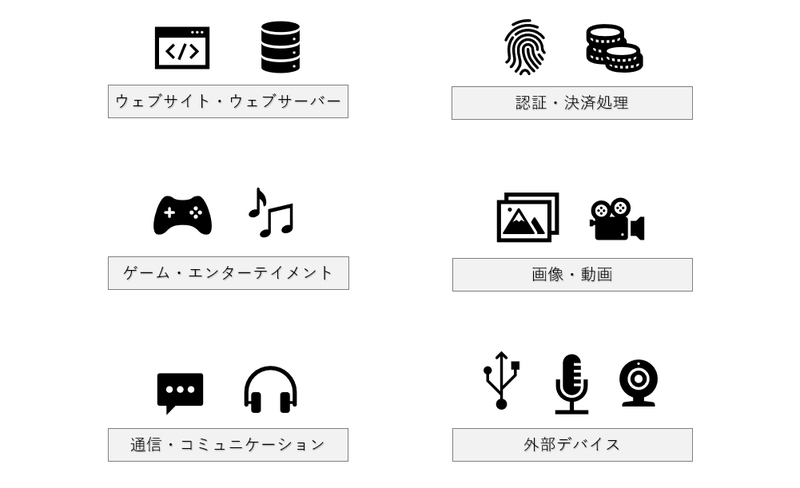
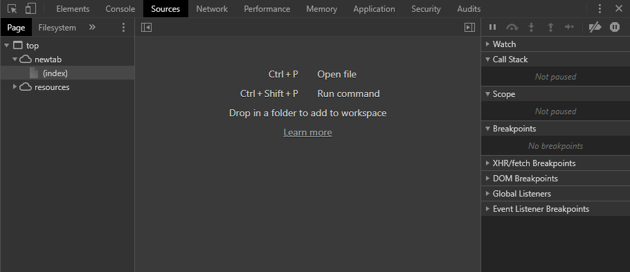
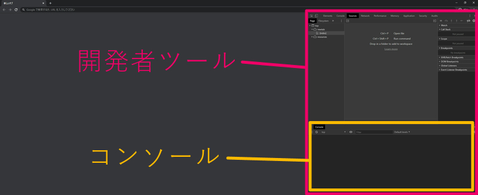

# JavaScript 基礎（エラー・デバッグ・開発者ツール）

* JavaScript基礎

<section class="contenttextsection">

## 概要

今回は JavaScript でプログラミングを行っている際に、必ず直面することになる **エラー** や、それを解消するための **デバッグ** 作業にフォーカスを当ててみます。また、デバッグ作業を行う際にとても役立つ **開発者ツール** についても、ここで簡単にその使い方について説明します。

JavaScript で開発を行う場合に限らず、プログラミングにおいては「エラーに直面したときにどう考え、行動に移すか」がとても大切です。なぜなら、エラーや不具合、あるいは意図していない動作は **必ず起こる** からです。

どんなに熟練したプログラマーであっても、エラーや不具合に直面することはあるはずです。そして、プログラマーとしての熟練度が高い人ほど「エラーや不具合、バグや意図しない動作は常に起こり得る」ということを理解していますし、それを前提にした上でどうするべきなのかを考えているものだと思います。

ウェブブラウザ上で動作する JavaScript を扱う上では、開発者ツールという非常に強力な機能を利用することができます。今回の内容を通じて、エラーやデバッグ作業、開発者ツールの使い方について、簡単にで構いませんので基礎を身に着けておきましょう。

## JavaScript のエラー表示

プログラミング言語によって多少の違いはありますが、エラー（Error）と言った場合、これは「プログラムが正しく動作することができなかった」ということを表します。JavaScript の場合は、エラーが発生してしまうと JavaScript の動作自体がそこで停止してしまい、その後の処理が行われなくなってしまいます。

通常、ウェブサイトをユーザーとして閲覧している場合は、この「JavaScript のエラー」を直接目にすることはほとんどありません。しかしその場合でも、後述する開発者ツールには人知れずエラーの内容が出力されるようになっています。

試しに、PC でこのページを閲覧しているのであれば、キーボードから、Windows 環境なら `Ctrl + Shift + i` を、Mac 環境であれば `Command + Option + i` を入力してみましょう。[JavaScript 基礎の第一回の記事](https://webgl.dev/?v=1)でも説明したとおり、このようなショートカットキーの入力を行うと開発者ツールを開くことができ、閲覧中のページでなにかしらのエラーが発生している場合には、この開発者ツールに内蔵されているコンソール上にエラーの内容が出力されているのを確認することができます。（もちろん、何もエラーが起こっていない場合もあります）

#### 開発者ツールのコンソールにエラーが表示されている例

ここでの例のように、開発者ツールのコンソールには、エラーが発生すると **赤い文字** でエラーの内容が示されます。JavaScript が原因で発生するエラー以外にも、HTML で指定されているファイルが見つからない場合などに、同様に赤い文字でエラーの内容がコンソール上に表示されます。

原因が JavaScript のソースコードにある場合は、原因となった箇所を「ファイル名と行番号」で示すリンクが表示されます。

このようなエラー箇所を示すリンクなどを活用しつつ、JavaScript のコードのうち、どの部分で、どのようなエラーが発生しているのかを把握し、なんとかして問題を解決することを目指すわけですね。

#### 開発者ツールのコンソールでエラーの箇所を確認できる

## ウェブブラウザなどのワーニング表示

また、開発者ツールのコンソールには、エラーだけでなく **ワーニング** が出力されることもあります。

ワーニング（Warning）とは、JavaScript の動作が止まってしまうような致命的な状況では無いけれども、推奨されない記述がなされていたり、あるいは開発者に注意を促したりしたい場合などに出力されることが多いです。

それらのほとんどはウェブブラウザ（たとえば Google Chrome）が自動的に出力しますが、なかには「JavaScript のコードを記述した開発者が意図的に出力している」場合もあります。

開発者がワーニングを出力するような記述をあえて行う場面の例を挙げると……　たとえば、「このライブラリでは、その○○という命令は今は一応動くけどもう古いよ、非推奨だよ！」みたいなことをライブラリの利用者に伝えたい場合などが考えられます。プログラムは大抵の場合日々改善されていきますので、昔は普通に使えた命令や記述方法であっても、それが時の経過と共に古いものになっていくこともあるわけですね。

#### 出力されたワーニングの例

このキャプチャ画像は、開発者ツールに出力された three.js というライブラリのワーニング表示です。ご覧の通り、エラー表示とは異なり、ワーニング表示では **黄色い文字** によってコンソールへの出力が行われます。

three.js では、画像の大きさ（高さと幅）が非推奨のサイズになっている場合、ライブラリ側で自動的にこれをリサイズします。非推奨のリソースを使ってますよ～ ということをワーニングとして表示することで、three.js を使っている開発者に対して注意を促しているわけですね。

> ### エラーとワーニング、そしてバグ

## エラーが発生すると JavaScript の実行が止まる

## エラー箇所の特定とステップ実行

## 開発者ツールのぜひ覚えておきたい機能

### Element パネル

### Source パネル

### Network パネル

### Performance パネル

### Memory パネル

## エラーやバグとの上手な付き合い方

## まとめ

</section>

